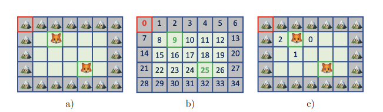

# Fundamentos da Programação - Projeto 2

# O Prado

O segundo projeto de Fundamentos da Programação consiste em escrever um programa
em Python que simule o ecossistema de um prado em que convivem animais que se movi-
mentam, alimentam, reproduzem e morrem. Para este efeito, deverá definir um conjunto
de tipos abstratos de dados que deverão ser utilizados para manipular a informação ne-
cessária ao decorrer do simulador, bem como um conjunto de funções adicionais.

## 1 Simulação de ecossistemas

A simulação de ecossistemas decorre num prado rodeado por montanhas. No início,
algumas das posições estão ocupadas por animais, que podem ser predadores ou presas,
e as restantes estão vazias ou contˆem obstáculos. Os animais podem-se movimentar,
alimentar, reproduzir e morrer, com regras diferentes para predadores ou presas. A po-
pulação do prado evolui ao longo de etapas de tempo discretas (gerações) de acordo com
estas regras. A simulação consiste na construção de gerações sucessivas da população
no prado.

### 1.1 O prado e os animais

Oprado ́e uma estrutura retangular de tamanhoNx×Ny, sendoNxo tamanho máximo
do eixo de abcissas eNyo tamanho máximo do eixo de ordenadas. Cada posição (x, y) do
prado ́e indexada a partir da posição de origem (0,0) que corresponde ao canto superior
esquerdo do prado. Num prado, todas as posições do limite exterior sãomontanhas,
ou seja, correspondem a posições que não podem ser ocupadas. As restantes posições
podem corresponder aespaços vazios, que são posições passíveis de serem ocupadas por
animais que habitam no prado, ourochedos, obstáculos que não podem ser ocupados
por nenhum animal. O exemplo da Figura 1a mostra um prado de tamanho 7×5, com
montanhas a toda a volta, e com dois animais situados nas posições (2,1) e (4,3).
Aordem de leituradas posições do prado ́e sempre feita da esquerda para a direita
seguida de cima para baixo, como mostrado na Figura 1b. A cada uma das posições de
um prado corresponde umvalor num ́ericoque respeita a ordem de leitura, ou seja, à
posição de origem (0,0) corresponde o valor 0, e às posições (2,1) e (4,3) da Figura 1a,
correspondem os valores 9 e 25, respectivamente.
Osanimais do prado são caracterizados pela idade (gerações passadas desde o
seu nascimento ouúltima reprodução), frequˆencia de reprodução (mínimo número de
gerações necessárias para se reproduzir), fome (gerações passadas desde aúltima ali-
mentação) e frequˆencia de alimentação (máximo número de gerações passíveis sem se
alimentar).



```
Figura 1: a) Prado de dimensão 7×5 com dois animais situados nas posições (2,1)
e (4,3). As posições cinzentas correspondem a montanhas ou rochedos enquanto que
o resto de posições correspondem a espaços livres do prado. A posição destacada a
vermelho indica a origem das coordenadas; b) Ordem de leitura das posições do prado.
A vermelho a posição inicial e a verde as posições dos animais; c) Indexação das posições
adjacentes livres à posição (2,1) no sentido dos ponteiros do relógio.
```

### 1.2 Regras de evolução

Em cada geração, cada animal de forma sequencial –seguindo a ordem de leitura do
prado– realiza o seu turno de ação. No início do turno de cada animal, a sua idade e
fome (apenas para os predadores) são incrementadas. A seguir, o animal tenta realizar
um movimento e eventualmente pode-se reproduzir, alimentar ou morrer de acordo com
as regras seguintes.

1.2.1 Regras de movimento

```
- Os animais movem-se para cima ou para baixo, para a esquerda ou para a direita,
    mas não diagonalmente. Os animais avançam no máximo uma posição por geração.
- As montanhas e rochedos não podem ser ocupados por nenhum animal (são muito
   íngremes para escalar).
- Ospredadorestentam mover-se para uma posição adjacente que tiver uma presa,
    comendo-a. Se várias posições adjacentes tiverem presas, então uma ́e escolhida
    usando o m ́etodo descrito abaixo. Se nenhuma posição adjacente tiver presas e
    se pelo menos uma das posições adjacentes estiver vazia, o predador move-se para
    lá (escolhendo usando o m ́etodo descrito abaixo). Caso contrário, permanece no
    lugar.
- As presas tentam mover-se para uma posição vazia adjacente, escolhendo de
    acordo com o m ́etodo descrito abaixo se houver várias vazias. Se nenhuma posição
    adjacente estiver vazia, permanece no lugar.
- As seguintes regras são aplicadas para selecionar uma posição quando múltiplas
    escolhas são possíveis:
```

1. Numerar as posições adjacentes possíveis começando de 0, no sentido horário a
    partir da posição 12:00 (ou seja, para cima, à direita, para baixo, à esquerda)
    como mostrado na Figura 1c. Apenas as posições que estão desocupadas
    (para movimentos) ou ocupadas por presas (no caso dos predadores, para os
    predadores comerem), são numeradas. Chamamospao número de possíveis
    posições.
2. Obter o valor numéricoNcorrespondente à posição atual ocupada pelo animal
    no prado. Por exemplo, na Figura 1b o valor num ́ericoNdo animal na posição
    (2,1) ́e 9.
3. A posição selecionada ́e aquela comíndice igual aN (modp). Por exemplo,
    na Figura 1c,N = 9,p= 3 eN(modp) = 9 (mod 3) = 0. Neste exemplo,
    a posição selecionada ́e a numerada comíndice 0, isto ́e, a posição (3,1) à
    direita da posição atual.

1.2.2 Regras de reprodução

Um animal que atingiu a idade de reprodução (considerando a geração atual), quando se
move, reproduz-se, deixando para trás na anterior posição um outro animal da mesma
esp ́ecie, frequˆencia de reprodução e alimentação, com idade igual a 0 e fome igual a

0. A sua própria idade ́e reinicializada a 0. Os animais não podem procriar se não se
moverem nesse turno (e a sua idade não ́e redefinida at ́e que realmente se reproduzam).

1.2.3 Regras de alimentação e morte

Os predadores comem apenas presas, não outros predadores. Se no fim do turno do
animal a fome de um predador ́e igual à sua frequˆencia de alimentação, o animal morre.
Quando um predador se alimenta de uma presa, a sua fome ́e reinicializada a 0.
As presas alimentam-se de ervas do prado e nunca morrem de fome (isto ́e, a sua
fome e frequˆencia de alimentação ́e sempre 0), mas morrem quando são comidas por
predadores.

## 2 Trabalho a realizar

O objetivo deste segundo projeto ́e definir um conjunto de Tipos Abstratos de Dados
(TAD) que deverão ser utilizados para representar a informação necessária, bem como
um conjunto de funções adicionais que permitirão executar corretamente o simulador de
ecossistemas.